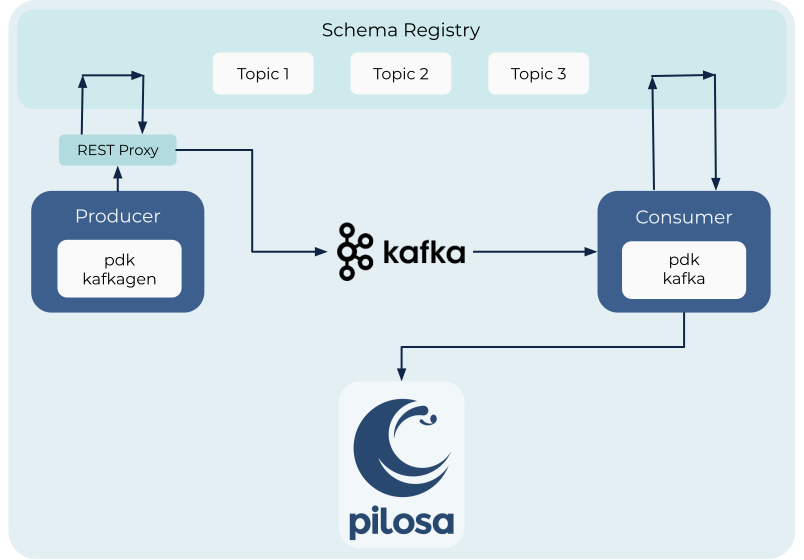

# pdk kafka

Pilosa supports a Kafka interface. For complete documentation on Kafka, please visit their Apache Foundation [documentation](https://kafka.apache.org).

## Overview

Pilosa's `pdk kafkagen` is a Kafka Producer. It generates random data and uses the REST proxy to load the data into Kafka. The REST proxy converts the JSON data produced by the `pdk kafkagen` into an Avro ID and message that Kafka can interpret. Each JSON schema has a corresponding Avro ID and message. The REST proxy acquires the Avro ID by querying the Schema Registry,which is only queried for every new schema. After the REST proxy receives the Avro ID, it can decode the JSON message and send both to Kafka. Producers other than `pdk kafkagen` can send data straight to Kafka or query the Schema Registry directly,as long as they are formatted correctly.

Once the data is in Kafka, Pilosa can use `pdk kafka`, which is a Kafka Consumer, to access the data and ingest it into Pilosa. `pdk kafka` queries Kafka and receives the Avro ID and message that will be inputted into Pilosa. After recieving the Avro ID and message, the `pdk kafka` will query the Schema Registry and procure the JSON schema that corresponds to the Avro ID. Similar to the REST proxy, `pdk kafka` will only query the Schema Registry for new schema. Once `pdk kafka` has the JSON schema, it can send decode the message and send both to Pilosa for ingest. Consumers other than `pdk kafka` operate in a similar manner, although they may add complexity.



For more information regarding REST proxy, please Confluent's [documentation](https://docs.confluent.io/current/kafka-rest/index.html). For more information regarding the Schema-Registry, please see Confluent's [documentation](https://docs.confluent.io/current/schema-registry/index.html). For more information regarding Pilosa's data model, please see the Pilosa [documentation](https://www.pilosa.com/docs/latest/data-model/).

## Loading Data From Kafka Into Pilosa

In order to load data that is already stored in Kafka into Pilosa, it is as simple as running `pdk kafka` in the terminal while both Kafka and Pilosa are running.
However, please note that Pilosa requries that you have kafka, Schema Registry, and kafka-rest (or REST proxy) running. To ensure that all of these are running, Kafka can be started using:

```
<confluent directory>/bin/confluent start
```

For more information about gettting started with Confluent and Kafka, please see their [documentation](https://docs.confluent.io/current/quickstart/index.html).

## Querying the Data

Once the data in Kafka is ingested by Pilosa, the Pilosa Query Language (PQL) will run appropriately. For a complete guide to the query options in various conventions, please the following:

* [Go](https://github.com/pilosa/go-pilosa)

* [Java](https://github.com/pilosa/java-pilosa)

* [Python](https://github.com/pilosa/python-pilosa)

* [Curl](https://www.pilosa.com/docs/latest/query-language/)